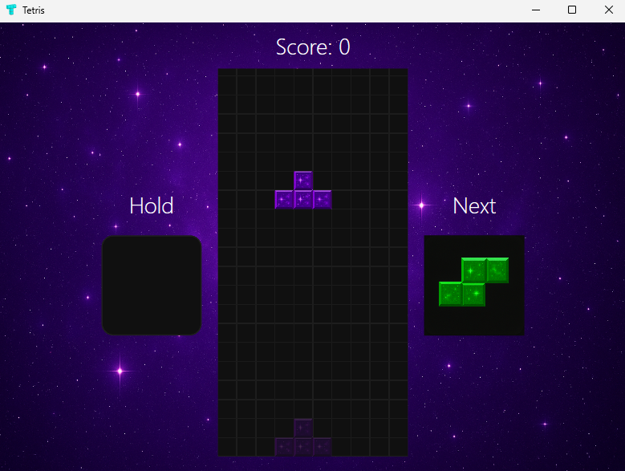
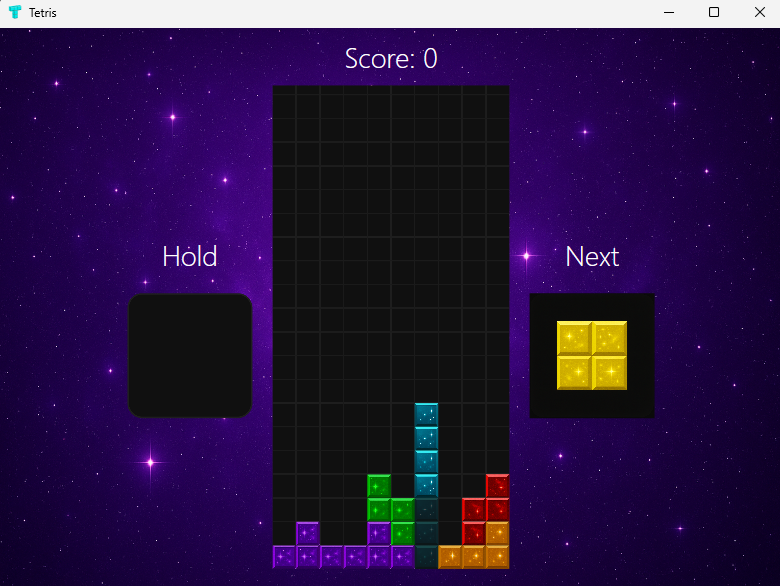
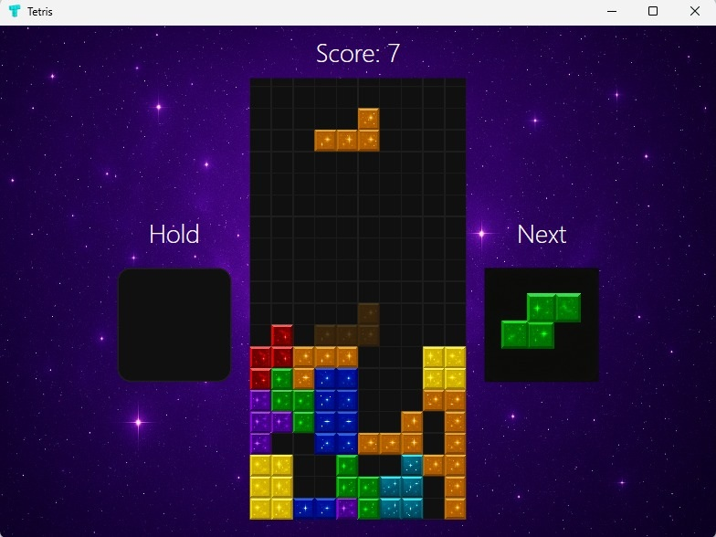
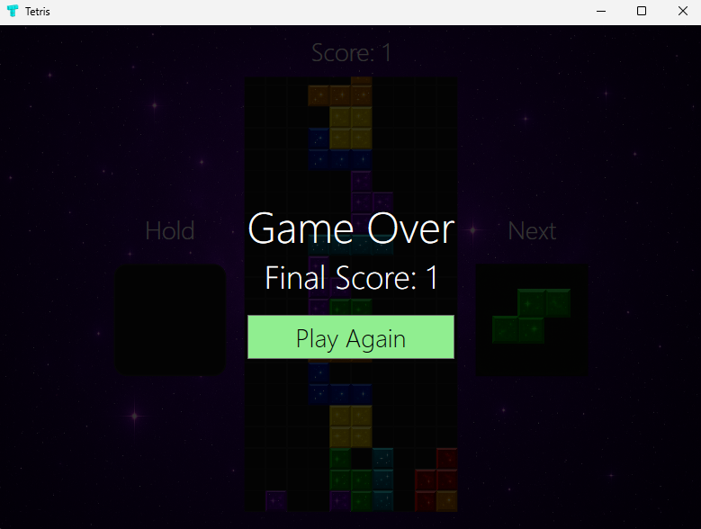

# 🎮 Jogo Tetris em C#

Um clássico jogo de Tetris desenvolvido em C# utilizando Windows Forms. O jogo possui mecânicas tradicionais, controle por teclado, pontuação e aumento de velocidade conforme os níveis progridem.

---

## 🚀 Funcionalidades

- Peças clássicas (I, O, T, L, J, S, Z)
- Rotação e movimentação com teclado
- Contador de pontos
- Aumento de dificuldade progressiva
- Detecção de Game Over
- Interface limpa e responsiva

---

## 🕹️ Controles

- ⬅️ Seta Esquerda – Move a peça para a esquerda  
- ➡️ Seta Direita – Move a peça para a direita  
- ⬇️ Seta Baixo – Queda lenta da peça  
- ⬆️ Seta Cima – Rotaciona a peça  
- Espaço – Queda instantânea   

---

## 📸 Capturas de Tela

 

 


---

## 🧩 Tecnologias Utilizadas

- C#
- Windows Forms (WinForms)
- .NET Framework ou .NET Core

---

## 🔧 Como Executar

1. Clone o repositório:

```bash
git clone https://github.com/CarolineGrizante/tetris-game-csharp.git
